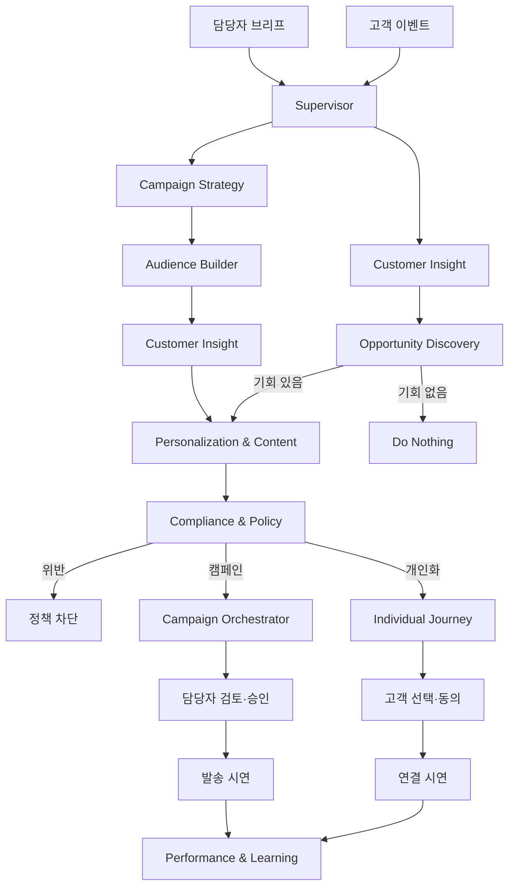

# 구조와 데이터 계약

## 원본 설계 매핑

뉴테크 프로젝트의 2026-09-30 최종 구성은 10개 agent, 6개 금융 도구, 2개 업무 흐름, 2개의 구분된 승인 지점입니다. IRP를 제외했습니다.

| Agent | 모듈 | 책임 |
|---|---|---|
| Supervisor / Orchestrator | `supervisor.py` | 업무 유형과 실행 계획 |
| Customer Insight | `insight.py` | 고객·고객군 요약 |
| Opportunity Discovery | `opportunity.py` | 기회 도구 호출, Do Nothing |
| Campaign Strategy | `strategy.py` | 콘셉트, 기획 아이디어 |
| Audience Builder | `audience.py` | 결정론적 대상, 제외, 중복 |
| Personalization & Content | `content.py` | 채널별 A/B 안내 초안 |
| Compliance & Policy | `compliance.py` | 정책 검증, 발송 차단 |
| Individual Journey | `journey.py` | 고객 선택·동의 후 연결 시연 |
| Campaign Orchestrator | `campaign.py` | 담당자 승인 후 발송 시연 |
| Performance & Learning | `performance.py` | 관측 기록 집계, 개선안 |



6개 도구는 마이데이터, 예적금·만기, AI 포트폴리오, 대출, 카드, 환급·절세 검토입니다. 별도 LLM agent로 늘리지 않고 Opportunity가 호출하는 결정론적 도구로 분리했습니다.

## 실행 경계

- `server.py`는 입력과 사용자 액션을 검증합니다.
- `engine.py`는 최대 4개 작업을 병행하며, 단계마다 `worker.py <agent_id>` 프로세스를 생성합니다.
- agent는 다른 agent 모듈을 import하지 않습니다. 공통 계약·정책·LLM·도구 라이브러리만 사용합니다.
- 상태·승인·DB·채널 부수효과는 engine에 집중합니다. agent는 순수 결과 또는 계획을 반환합니다.
- Worker는 JSON stdin/stdout 계약을 사용하므로 CLI 테스트 및 HTTP/메시지 큐 실행기로의 교체가 가능합니다.
- 기본 프로세스 타임아웃은 60초입니다. LLM HTTP 타임아웃은 45초입니다.
- LLM은 자연어 생성만 맡습니다. 대상 SQL 실행, 동의, 적합성, 금액·예산, 실제 실행 여부는 결정론적으로 판단합니다.

## 입력 계약 v1

```json
{
  "contract_version": 1,
  "request": {"mode": "event", "event_type": "salary", "customer_id": "C0001", "amount": 4200000, "channel": "push"},
  "customers": [],
  "results": {},
  "decision": null,
  "deliveries": [],
  "previous_audience": [],
  "llm_enabled": false
}
```

`results`에는 필요한 선행 agent의 출력이 키별로 들어갑니다. 예: Content는 개인화 시 `opportunity.domain`을, 캠페인 시 `request.domain`을 사용합니다. 독립 실행은 필요한 선행 결과를 fixture로 제공하면 됩니다. 출력은 `summary` 문자열을 포함하는 객체이고, 실행기는 `{ok, output}` 또는 `{ok:false,error}` 봉투로 응답합니다. 비밀 키는 입력 계약·실행 이력에 포함하지 않습니다.

## 상태와 복구

`queued → running → waiting_customer / waiting_approval → queued → running → completed`

분기 종료 상태는 `blocked`, `no_action`, `failed`, `cancelled`입니다. 승인·선택 시 새 단계 실행 이력을 추가하므로 이전 대기 결과도 남습니다. 재시도는 실패 단계부터 같은 작업 ID로 수행하고 성공 결과는 재사용합니다. 장애 주입 시나리오의 재시도는 `inject_failure`만 제거합니다.

SQLite 쓰기 트랜잭션과 프로세스 내 잠금이 상태 전환·최종 발송을 직렬화합니다. 발송은 `BEGIN IMMEDIATE`에서 최신 고객 동의·횟수·조건·예산을 확인하고 유일 키로 기록합니다. 승인 버튼 연속 클릭, 재시도, 동일 요청 재전송이 중복 발송을 만들지 않도록 합니다. 실행 도중 서버가 중단되면 다음 시작에서 해당 작업을 실패로 표시합니다. 자동으로 외부 부수효과를 재시도하지 않습니다.

## 저장 모델

| 테이블 | 내용 |
|---|---|
| customers | 가상 고객, 잔액, 보유 상태, 동의, 금융 맥락 |
| jobs | 요청·상태·결정·누적 결과·멱등성 키 |
| steps | agent별 실행 시도, 시간, 입력 요약, 전체 출력, 오류 |
| deliveries | 작업/고객별 발송 시연, A/B, 반응, 비용 |
| audit | 작업과 시스템의 추가형 감사 이벤트 |
| reports | 생성 시점 지표·표·추천의 불변 스냅샷 |
| settings | 초기 데이터 생성 버전 |

스키마 버전은 `PRAGMA user_version=1`, 읽기·쓰기 병행은 WAL 모드입니다. 모든 DB 연결은 작업 후 종료합니다. 운영 마이그레이션이 추가되면 버전 증가와 데이터 보존 테스트가 필요합니다.

## 시연 구현의 경계

- 고객 원장은 가상 fixture입니다. 급여·잔액 증가 금액은 해당 작업의 분석 컨텍스트에만 더하고 원장을 재기장하지 않습니다.
- 자연어 조건 자동 채우기는 한국어 도메인 키워드와 금액 표현을 돕는 규칙이며 범용 자연어 SQL 엔진이 아닙니다. 담당자가 확인한 명시적 필터가 최종 기준입니다.
- 캠페인 A/B 문안은 교대로 배분하고 가상 반응을 생성합니다. 개인화 반응은 사용자가 선택한 결과로 기록합니다.
- 금융 규제 판정·세금 계산·실제 상담/상품 API가 아닌 안내 및 연결 시연입니다.
- 미래 일정 예약, 배포 서버 인증, 다중 인스턴스 큐, 장기 보존 정책은 후속 연결 지점입니다.
